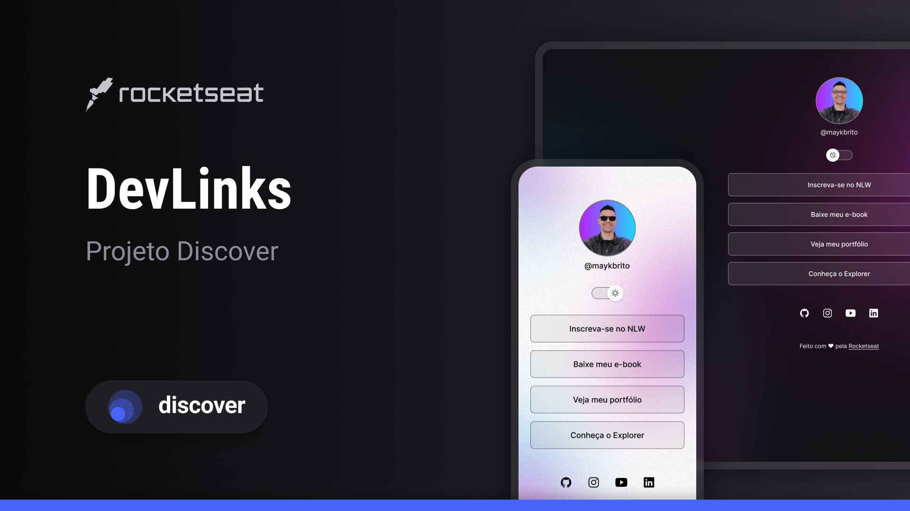

<h1 align="center">Devlinks</h1>

  

## 🚀 Tecnologias

Esse projeto foi desenvolvido com as seguintes tecnologias:

- HTML e CSS
- JavaScript
- Git e Github
- Figma

## 💻 Projeto

Este projeto foi desenvolvido durante o curso Discover da Rocketseat(gratuito na plataforma da mesma),com a função de ser uma página igual as geradas por sites como o <a href="https://linktr.ee/">Linktree</a>.

## 📋 Layout

Você pode visualizar o layout do projeto através
<a href="https://www.figma.com/community/file/1187422022288947321">DESSE LINK</a>. É necessário ter conta no <a href="https://www.figma.com/">Figma</a> para acessá-lo.

## 📝 Licença

Esse projeto está sob a licença MIT.
